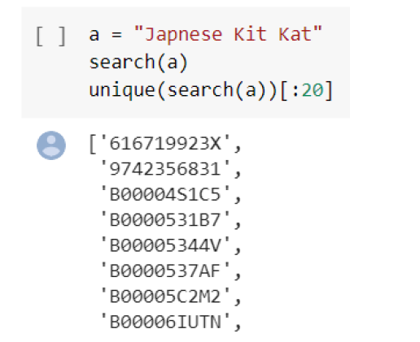
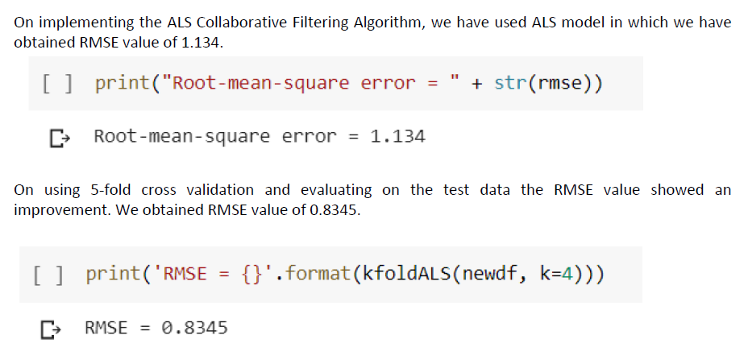

## OBJECTIVE
The objective of the project is to develop a product recommendation system based on the customer’s interest. The purchase history is retrieved to capture customer’s inclination for a set of products available in the store. The data extraction, exploration, transformation and analysis would be achieved through Apache Spark system. Based on the analysis, the system would recommend products for customers who would most likely be inclined to buy a set of products along with the current product picked up for check out. This recommendation system is intended to help e-commerce web sites to service customers with appropriate recommendations at the right time with an attractive price tag.

## DATA DESCRIPTION
The Dataset was obtained from the website: https://nijianmo.github.io/amazon/index.html
The data set is a part of Amazon review dataset released in 2014, provided by UCSD.
The data set contains data for 287,209 products with 5,074,160 reviews and ratings by 1, 57,386 unique users.
Data does not contain any null values
We used 80% of data for training and 20% for testing.
Tokenizing, removal of stop words and stemming was done for textual data

## DATA MODELLING AND CLASSIFICATION – Techniques Used Collaborative Filtering Algorithm and K-means
## Technique 1 – K-means (Context Based Filtering)
1. Based on the reviews obtained above we have created its TF-IDF using TfidfVectorizer function.
2. Since we are handling huge amount of data with our data frame having 5,074,160 reviews we have done rest of the operations in Apache Spark for efficient and faster handling of big data. We have created a Spark data frame from the pandas reviews data frame
3. Next we have created a data cleaning pipeline using the Pipeline function in which we have cleaned the spark data frame by tokenizing the reviews, removing stop words, calculated the term frequencies (TF) and IDF for the tokenized words.
4. We have clustered the products. So now whenever a new input keyword has been searched, it would pass through pipeline for cluster assignment. Products under the respective cluster are up for recommendation.

## Technique 2 – ALS Collaborative Filtering Algorithm
1. We have obtained a Spark data frame containing item id, user id and ratings
2. Alternating Least Squares algorithm requires the inputs to be numerical and integers with value less than 2,147,483,647 (32-bit limit). So we have created new index for item_id and user_id using StringIndexer with definitive mapped values for each user and item.
3. We have split the data into (80%) training and (20%) testing. We have used ALS (Alternating Least Squares) algorithm for training the data.
4. We have evaluated the model on the test data. We have got RMSE value of 1.134. We thought that it might be over fitting the data so we implemented 5-fold Cross Validation in the next step.
5. After implementing 5-fold ALS Cross Validation and evaluating on the test data we have obtained a RMSE value of 0.8345 which showed an improvement from the previous time
6. Finally, using our model we are obtaining TOP 10 recommendations for all the users in our data frame.

## RESULTS AND CONCLUSION
By analyzing our dataset through various tools like R, Python, Pyspark we developed a product recommendation system based on the customer’s interest. We have used 2 different models for this purpose i.e. K-means and ALS Collaborative Filtering.
For the K-means which does context based filtering, we have tested our model with a test data which shows products under their respective cluster. It shows the products which are closely related to Kit Kat.
